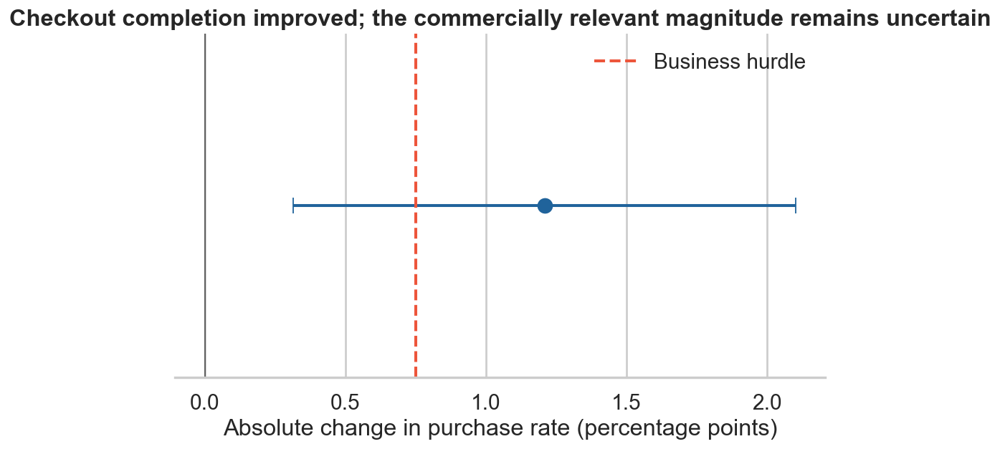
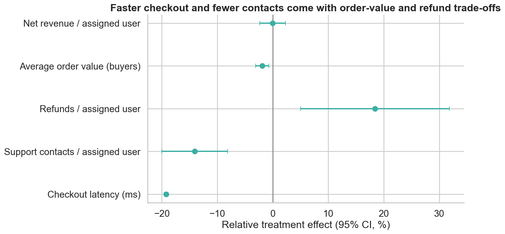
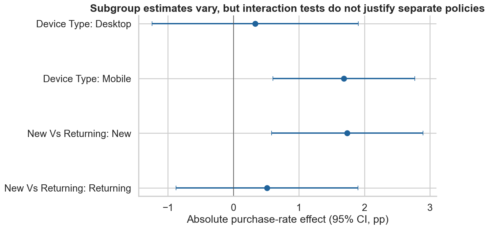
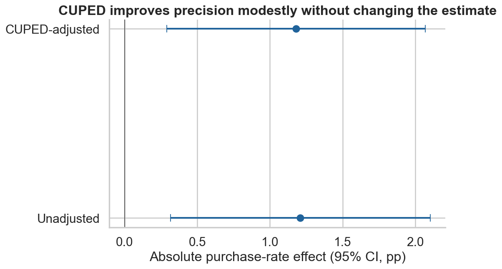
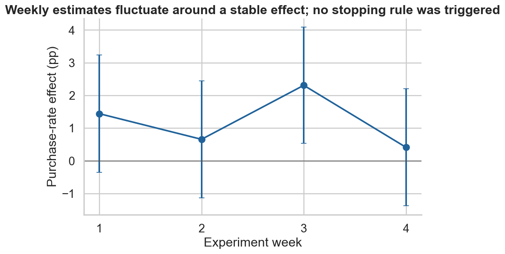

# Checkout Experiment — Simplified Checkout Evaluation

## Executive summary

A 28-day randomized experiment tested a simplified checkout among 48,000 users at their first eligible checkout start. Treatment increased purchase within 24 hours from **47.02% to 48.23%**: **+1.21 percentage points** (95% CI +0.32 to +2.10; p=0.008).

The experiment establishes product efficacy more strongly than commercial value. The positive conversion effect is compatible with lifts both below and above the pre-defined +0.75-point commercial hurdle. Net revenue per assigned user showed no demonstrated improvement, average order value declined 1.9%, and refunds per assigned user increased 0.35 points. Treatment did reduce support contacts and checkout latency.

**Recommendation: iterate and retest.** Preserve the performance and usability improvements, diagnose the refund and basket-value trade-offs, and test a revised version. The experiment does not support broad rollout or a mobile-only policy from the current evidence.



## Business question

Did the simplified checkout improve the product enough to ship?

The decision considers incremental completion, uncertainty, commercial value, guardrails, validity, pre-specified segment evidence, time stability, and implementation risk—not a p-value alone.

## Experiment design

| Element | Pre-specified choice | Reason |
|---|---|---|
| Hypothesis | Simplifying checkout increases completed purchases | Targets the identified friction directly |
| Randomization unit | User | Prevents inconsistent checkout experiences across sessions |
| Eligibility | User reaches a first eligible checkout during the 28-day enrollment window | Aligns assignment with the surface being changed |
| Control | Existing checkout | Current production experience |
| Treatment | Simplified checkout | Fewer interaction costs and faster execution |
| Primary metric | Purchase within 24 hours / assigned users | Captures completion while preserving intention-to-treat |
| Analysis population | All eligible assigned users | Avoids bias from post-assignment engagement or exposure |
| Intended duration | Fixed 28 days | Covers four weekly cycles without optional stopping |

All data are synthetic and generated with a fixed seed. The results do not describe real customers. Generation parameters are documented in the source code.

## Metrics

- **Primary:** purchase within 24 hours per assigned user.
- **Secondary:** net revenue per assigned user and sessions within seven days.
- **Guardrails:** average order value, refunds per assigned user, support contacts per assigned user, and checkout latency.

Revenue uses all assigned users and therefore retains randomization. Average order value is useful diagnostically but is conditional on the post-treatment event of purchasing, so it receives less decision weight than revenue per assigned user.

## Power and MDE

Planning assumed a 45% baseline, two-sided α=0.05, 80% power, and a **1.5 percentage-point minimum detectable effect**. This required **17,315 users per arm**, or **34,630 total**. The realized sample of 48,000 exceeded that requirement.

The statistical MDE answers what the design can reliably detect. The separate **+0.75-point business hurdle** represents the smallest lift considered commercially worthwhile given implementation and operational costs. Detectability and commercial value are different quantities; the hurdle informs the overall decision rather than acting as a universal confidence-interval shipping rule.

## Experiment health

- Control: 23,974 users; treatment: 24,026.
- SRM test: p=**0.812**; there is no evidence that observed allocation differs from 50/50.
- Largest absolute standardized difference across declared pre-treatment balance checks: 0.024.
- No missing primary outcomes or required assignment fields.
- All users met the checkout-trigger eligibility rule.
- Enrollment covered the planned 28 days.

No material validity issue was found in the observed diagnostics.

## Primary result

| Metric | Control | Treatment | Absolute effect | Relative effect | 95% CI |
|---|---:|---:|---:|---:|---:|
| Purchase within 24 hours | 47.02% | 48.23% | +1.21 pp | +2.57% | +0.32 to +2.10 pp |

The result provides evidence of a positive conversion effect at the pre-specified 5% level. The confidence interval includes effects below and above the +0.75-point business hurdle, leaving uncertainty about whether the durable lift is reliably large enough to meet the commercial target. That uncertainty is considered alongside revenue and guardrails rather than used as a mechanical ship/no-ship rule.

## Guardrails



| Metric | Control | Treatment | Effect | Interpretation |
|---|---:|---:|---:|---|
| Net revenue / assigned user | £44.58 | £44.56 | −£0.02; 95% CI −£1.06 to +£1.01 | No demonstrated revenue improvement |
| Average order value, buyers | £98.82 | £96.92 | −£1.89 (−1.9%); 95% CI −£3.08 to −£0.70 | Estimated adverse basket-value movement; conditional metric |
| Refunds / assigned user | 1.90% | 2.25% | +0.35 pp; 95% CI +0.09 to +0.60 pp | Evidence of a small absolute refund increase |
| Support contacts / assigned user | 7.87% | 6.76% | −1.11 pp; 95% CI −1.57 to −0.64 pp | Evidence of fewer support contacts |
| Checkout latency | 2,181 ms | 1,762 ms | −420 ms; 95% CI −427 to −412 ms | Clear performance improvement |

The treatment appears easier and faster, but extra completions do not translate into demonstrated higher net revenue in this sample. The refund increase is small in absolute terms but precisely positive over the seven-day observation window; the AOV decline is also estimated below zero. AOV remains conditional on purchasing, and treatment can change buyer composition, so it is interpreted diagnostically rather than as a standalone causal business metric.

## Segment analysis



Point estimates were larger for mobile (+1.69 pp) than desktop (+0.33 pp), and for new (+1.74 pp) than returning users (+0.51 pp). However, the direct treatment-interaction tests were inconclusive: p=0.163 for device and p=0.179 for new versus returning.

A significant estimate in one subgroup and a non-significant estimate in another does not prove the subgroup effects differ. These pre-specified results are useful for follow-up design but do not justify segment-specific shipping.

## Variance reduction



CUPED used only the pre-treatment 28-day purchase indicator. Its correlation with the primary outcome was 0.107, producing a modest **1.15% variance reduction**. The adjusted effect was +1.18 points with essentially the same decision.

The adjustment does not address broken randomization, missing outcomes, or post-treatment selection.

## Time dynamics



Weekly estimates ranged from +0.41 to +2.31 points, with overlapping intervals. A treatment-by-day interaction showed no evidence of a linear trend (p=0.894). The fixed-duration estimate remains primary. Repeatedly examining cumulative p-values and stopping on the first significant day would invalidate the planned false-positive rate.

## Decision

**Iterate and retest rather than ship broadly.**

1. Preserve the latency and support-contact improvements.
2. Investigate whether shorter checkout changes basket composition, purchase deliberation, or refund-generating orders.
3. Revise the intervention to retain order context and confirmation clarity.
4. Retest with purchase completion as primary and net revenue, refunds, and support as pre-specified guardrails.

The total evidence supports checkout efficacy but not yet a sufficiently clear commercial case: conversion improves, revenue does not, and refund and AOV movements create trade-offs. That combined picture—not a rule requiring the primary interval's lower bound to exceed the hurdle—supports iteration and retesting. The experiment also does not establish a segment-specific rollout policy.

## Limitations

- Synthetic data limits external validity.
- Refunds are observed for seven days, not through the full return lifecycle.
- Margin, cancellation reasons, payment-provider failures, and qualitative feedback are unavailable.
- Eligibility begins at checkout, so results do not generalize to users who never start checkout.
- AOV and buyer refund rates condition on purchasing and can reflect treatment-induced composition changes.
- The experiment is powered for the overall primary metric, not interaction tests or rare adverse events.

## Repository structure

```text
├── README.md
├── requirements.txt
├── run_all.py
├── data/{raw,processed}/
├── notebooks/experiment_analysis.ipynb
├── sql/
├── src/
├── outputs/figures/
└── docs/methodology.md
```

## Reproduction

```bash
# Tested with Python 3.12
python -m venv .venv
# Windows: .venv\Scripts\activate
# macOS/Linux: source .venv/bin/activate
pip install -r requirements.txt
python run_all.py
```

The command regenerates the fixed-seed data, recomputes all estimates and figures, executes every SQL query, reconciles README values, and executes the notebook top to bottom.

